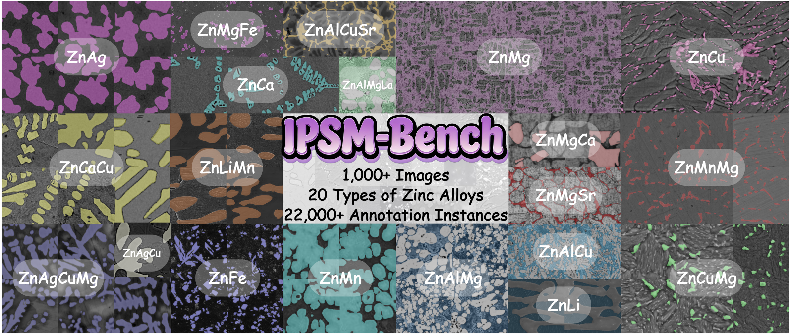

# IPSM-Bench: A New Intermediate Phase Segmentation Benchmark in Microstructure Images of Zinc-based Absorbable Biomaterials

This repository contains the Benchmark for Intermediate Phase Segmentation. (IJCAI 2026)
[[arXiv](https://arxiv.org/pdf/2606.11001)]

## Overview

<center>
    
    <br>
    <div style="color:orange; border-bottom: 1px solid #d9d9d9;
    display: inline-block;
    color: #999;
    padding: 2px;">
  	</div>
</center>


# IPSM-Bench Dataset

## Introduction

IPSM-Bench contains 1,054 microstructural images (512×512), comprising SEM and OM images, covering 20 types of zinc-based alloys and 22,179 manually annotated intermediate phase instances. 

## Dataset Download

* IPSM-Bench is made available solely for academic research. Redistribution, commercial exploitation, and any use outside the scope stipulated in the signed agreement are strictly prohibited.
* Researchers who intend to access the dataset shall complete and sign the data usage agreement, then submit the fully signed agreement to the designated contact email address.
* Contact emails: xujinglin@ustb.edu.cn, m202520912@xs.ustb.edu.cn

## Citation

```bibtex
@inproceedings{IPSM-Bench_ijcai2026,
  title     = {IPSM-Bench: A New Intermediate Phase Segmentation Benchmark in Microstructure Images of Zinc-based Absorbable Biomaterials},
  author    = {Jinglin Xu, Shangyan Zhao, Jiabo Wang, Xinghong Mu, Yulong Lei, Jiacheng Zhang, Hongbo Sun and Yageng Li},
  booktitle = {Proceedings of the 35th International Joint Conference on Artificial Intelligence},
  year      = {2026}
}
```


